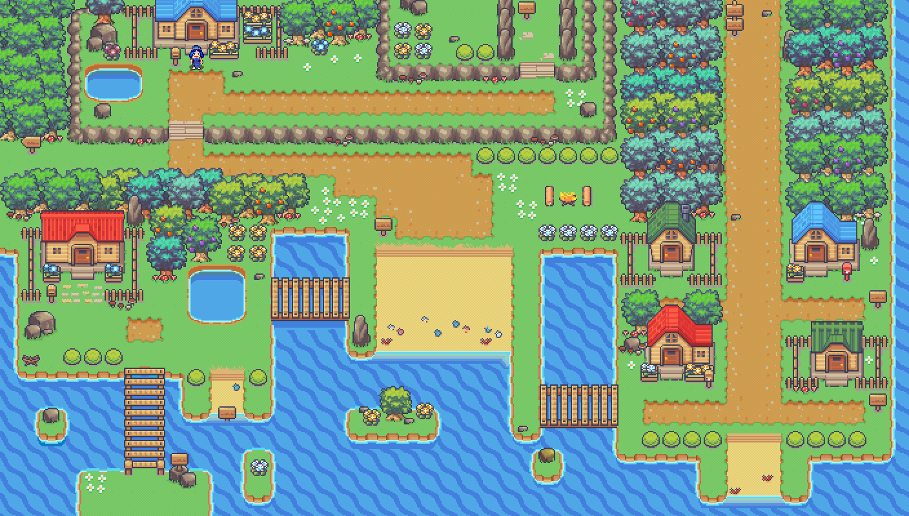
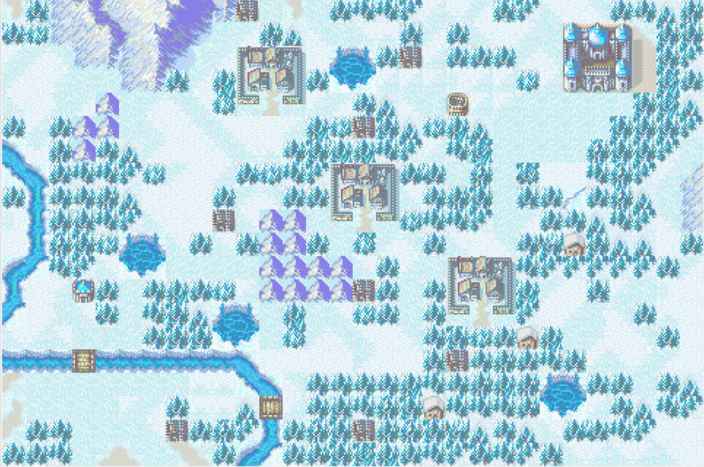

# 🎮 RPG Épique

<div align="center">
  
</div>

## 📜 À propos du jeu

Ce RPG est un jeu d'aventure et de combat développé avec la bibliothèque SFML en C. Plongez dans un monde fantastique où vous contrôlerez différents personnages avec des capacités uniques pour affronter des ennemis et des boss à travers 8 mondes différents.

## ✨ Caractéristiques

- 🧙‍♂️ **Cinq personnages jouables** avec des capacités et des compétences uniques:
  - **Roy** - Le guerrier à l'épée
  - **Infenium** - Le mage avec des livres de sorts
  - **Patecarbo** - L'archer habile
  - **Xmarano** - Le combattant à la lance
  - **Racaillou** - Le guerrier à la hache

- ⚔️ **Système de combat tactique** avec des armes variées et des compétences spécifiques

- 🌍 **Huit mondes uniques** à explorer avec leurs propres défis et boss

- 💼 **Système d'inventaire** pour gérer vos armes et objets

- 🛒 **Boutique** pour améliorer votre équipement

- 💰 **Économie de jeu** avec système de pièces d'or

- 🎵 **Effets sonores et musiques immersives**

- 💾 **Système de sauvegarde automatique**

## 🎮 Contrôles

- **ZQSD** - Pour se déplacer
- **Souris** - Pour interagir avec l'interface
- **I** - Ouvrir l'inventaire
- **P** - Menu de pause

## 🖼️ Captures d'écran

<div align="center">
  
  <p>Village</p>
</div>

<div align="center">
  
  <p>Personnages</p>
</div>

<div align="center">
  
  <p>Cartes du monde 7</p>
</div>

## 📋 Prérequis

- CSFML (bibliothèque SFML pour C)
- GCC ou autre compilateur C compatible
- Make

## 🔧 Installation

1. Clonez ce dépôt
   ```bash
   git clone [votre-dépôt]
   cd RPG
   ```

2. Compilez le projet
   ```bash
   make
   ```

3. Lancez le jeu
   ```bash
   ./my_rpg
   ```

## 🚀 Mode développeur

Lancez le jeu avec l'option `-dev` pour activer le mode développeur:
```bash
./my_rpg -dev
```
Ce mode vous donne 100000 pièces d'or et débloque certaines fonctionnalités.

## 👨‍💻 Développeurs

- Yanis Prevost
- Leo Gregori
- Tom Clerc
- Anthony Colombani-Gailleur

## 📝 Licence

Ce projet a été développé dans le cadre d'un projet EPITECH.